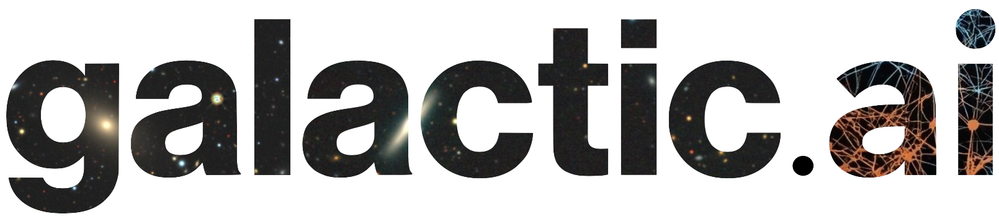

## Mission statement

The primary goal of the `galactic.ai` Lab is to combine cutting-edge statistical and ML techniques with the billions of galaxies that will be observed by galaxy surveys to answer fundamental questions in cosmology and galaxy evolution: What is the nature of dark energy that drives the accelerated expansion of the Universe? What is the sum of neutrino masses? How does the underlying dark matter environment of galaxies impact their evolution? 

Our broader goal is to leverage interdisciplinary expertise in ML, observations, and simulations to achieve ambitious science goals in cosmology and astronomy that are out of reach with conventional methods.

## Expectations

For new members, below are expectations of the Lab. 

_The use of the word "we" indicates that you are part of a group, and usually several of us will be involved in any of these items, but ultimately it's my (Chang) responsibility to ensure that you get the experience you deserve._

**You can expect that**

* We help you become the person you seek to be.  
  People are different, and we value your individual perspective and treat you with respect.
* We are committed to your success.  
  We will support your intellectual and professional development through focused advising (research projects, course selection, work dissemination, etc.) and broader mentoring (career choices, work-life balance, etc). 
* We promote you as a scientist by 
  1. helping you think clearly about your research
  2. providing opportunities and support for you to present at meetings and conferences
  3. provide guidance in larger collaborations
  4. advertising your results as broadly as possible in our profession
  5. providing the financial means for realizing your projects.
* We respect academic requirements and personal challenges.   
  If you need time, ask for it and you will get it.
* We cultivate a supportive, welcoming, and professional environment   
  Everyone should feel respected and comfortable engaging in a diverse array of scientific topics, challenging others, and being challenged themselves.
* We seek to work smart, not hard. "All work and no play" is a myth we do not perpetuate.   
  Decide what amounts to a "good day's work". If you have achieved it, be happy and end early. If you haven't, try to understand why it didn't work out. Then try to do it better the next day. Split your larger project into milestones, and celebrate when you've achieved one.
* You get strongly supportive letters of recommendation whatever your future plans might be.

**We expect that you**

* Take ownership of your research and career.   
  Always keep in mind that it is your project, and ultimately yours will be the first name on the paper. Understand your project inside and out, how it fits into the larger picture, etc. Also, recognize that no one will care as much about your career and future as you do. We will look out for you and keep your best interests in mind. However, you need to be your own best advocate.
* Learn the skills and review the literature needed for your project(s).   
  Be well read in your research area and keep up with interesting papers on the periphery or entirely outside your research. This is one way your research direction can evolve over time. Ask questions. There's no such thing as a stupid question. Also attend talks and talk to other scientists. 
* Be prepared and on time for meetings.   
  Meeting time is a very limited resource, use it wisely. If you feel that a meeting is not necessary, cancel or postpone it ahead of time. 
* Be a generous team player.   
  There are research areas where you are the expert in the Lab. 
  Help answer questions and share your ideas within your project team and the Lab. 
  Help others when you see them struggle. Remember that your research happens in the context of the research group. 
* Express your thoughts on research ideas and projects as well as the Lab culture and working style, in any way you feel comfortable.  
  Research and group dynamics are both complicated, with many unknowns, implicit assumptions, and traditional thinking; 
  we need your perspective to make the Lab as great a research environment as it can be.
* Accept that research is incremental and has its ups and downs.   
  We all experience frustration over slow progress or failures. It is acceptable and normal to be unproductive for an occasional week or two. Analyze why something failed and use that experience and insight to motivate your next step. If you feel like you are not making progress on a ~month timescale, seek help so that we can develop more effective work habits and/or modify the project to better fit your interests and strengths. 
* Communicate clearly.   
  Writing and speaking well is a skill, make every effort to master it (some details [below](#collaborative-writing)). 
  Aim for clarity and brevity over flair and style.

## Communication

We try to capture most discussions as text, which enables review and asynchronous interactions. We heavily rely on github because it can bring together all elements of the research workflow (from ideation to creation to publication) in a coherent way and helps keep track of projects. If you need help to get started with git and github, review [this guide](https://guides.github.com/introduction/git-handbook/) and its various pointers.

Here's the recommended workflow (deviations from it can and will happen, this is work-on-progress).

1. **For immediate blockers:** 
   Use instant messaging (slack). If there's a chance that the problem may affect others: leave an issue in the relevant project repo (step 2) or use the group's channel on slack (step 5).
2. **For project work:**
   Use a repo that has been created for this project or follow these steps. 

  * Create a project repo with a memorable name. You can make it public or private. 
  * Add a README file that explains the general idea (i.e. a blueprint of your project). Update the README file as needed to reflect that current stage and give everyone a quick way of understanding what you're working on.
  * Share the repo with your project team. For students: Share the repo with your advisor(s).

3. **For project discussions:** 
   Use issues in your project repo for updates, questions, and whatever else directly related to the project. 
   Doing so documents your progress in a very capable tracking system.
   Maintain and inter-link issues when the relate to one another.
   Request review and comments as needed.
   This is the main benefit of github issues: you can ask anyone (from the Lab, or a new collaborator) about a problem, and they can quickly get an overview of your problem (with the README you've already created, right?)
   Private slack message, on the other hand, do not allow this inclusion of a project team member after the fact, so avoid them as much as possible.
4. **For paper drafts:**
   [Overleaf](www.overleaf.com) and share with your co-authors. Or the paper can also be the code of the project repo. 
5. **For proposing project ideas:**
   Create a discussion on the private group's [github Discussion page](https://github.com/orgs/galactic-ai/discussions).
   Give it a few days to allow for comments from everybody interested.
   If the team discussion concluded that the idea has merit, request a slot at the next suitable meeting.
6. **For approved ideas:** 
   Go to step 2.

The guiding principle is to create the conditions, in which everyone can work effectively and independently while utilizing the power of the group to advance our research.

## Meetings

We use **group meetings** for

* introducing a new person and their work
* introducing a broadly relevant topic
* direct immediate interactions (e.g. brainstorming, work sprint).

They should be rare to make best use of the time committment for the entire group.

We use **individual meetings** for personal check-ins.

* for undergrads and grad students: weekly meeting to review of the ongoing projects and career options;
* for postdocs: ~every months to review projects and overall career development.

To discuss a specific project (either in the group or individual), we provide documentation of that project (including its README file) in addition to any relevant materials/updates.

----
_This document is meant to be updated as needed. Create a PR for suggestions._
